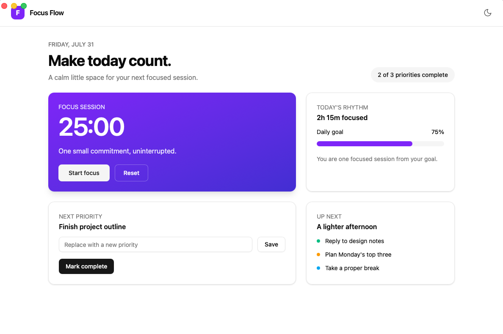

# Focus Flow

Focus Flow is a small, local-first focus planner built with Rust, Leptos, and
Tauri. It is **early alpha**: a useful desktop prototype, not a production
release.



This preview shows the current prototype dashboard; visual details may change
as the desktop product evolves.

## Implemented features

- Home dashboard with a focus timer, task editing, completion count, daily goal,
  and weekly focus-minutes chart.
- Settings for session length and daily focus goal.
- Collapsible desktop sidebar and light/dark theme toggle.

## Current limitations

- Tasks, settings, and focus history are in memory for the current session;
  durable persistence is planned, not implemented.
- The weekly chart uses prototype data rather than persisted history.
- Desktop is the supported product surface; mobile parity is not promised.
- Installers are experimental until signing and public distribution are
  configured.

## Supported platforms and installers

The supported release targets are macOS and Windows desktop builds through
Tauri. Build an installer on the operating system you are targeting; the
release workflow can produce a macOS application bundle/DMG and Windows
installer from tagged releases after signing credentials are configured.

## Run locally

Install the pinned tools in [PREREQUISITES.md](PREREQUISITES.md), then follow
the quick start:

```sh
pnpm install
cargo tauri dev
```

Development builds generate the CSR frontend in `dist/` and serve it on a
loopback development port. The installed application embeds the same assets;
it does not start Node.js, Axum, or a network service at runtime.

## Verify changes

Run the same quality gate used by pull requests:

```sh
just check
```

## Runtime and architecture

```text
Leptos UI → WorkspaceController → WorkspaceService → focus-flow-core
Tauri wrapper ── embeds the CSR bundle; it has no app commands yet
Optional Axum/SSR adapter ── renders the same app shell for web development
```

Read [ARCHITECTURE.md](ARCHITECTURE.md) for boundaries, ports, and runtime
topology. Accepted decisions are in [docs/adr](docs/adr/), including the
[embedded desktop runtime](docs/adr/0001-embedded-desktop-runtime.md) and
[hexagonal boundaries](docs/adr/0002-hexagonal-boundaries.md).

## Privacy and offline runtime

Focus Flow has no account system or remote product backend. Tasks and settings
stay local to the current session, and installed desktop builds embed the UI
without requiring Node.js, Axum, an open port, or an internet connection.

## Contributing

Read [CONTRIBUTING.md](CONTRIBUTING.md), then choose a bounded first change:
documentation fixes, accessibility improvements, or a shared UI refinement
are good starting points. Discuss behavior, architecture, runtime, or
persistence changes in an issue or ADR before implementation. See
[DESIGN.md](DESIGN.md) for presentation rules and [AGENTS.md](AGENTS.md) for
the file map and contributor workflow.

## Open-source TODOs

The source is open for contributors now. These items are follow-up work, not
requirements for reading, building, or improving the project:

- [ ] Confirm the final copyright holder and repository ownership.
- [ ] Add maintainer-approved private security and conduct-reporting contacts.
- [ ] Choose the long-term support channel and response expectations.
- [ ] Install `cargo-audit` and include the Rust advisory result in release
  preparation.
- [ ] Configure macOS and Windows signing credentials before calling installers
  production-ready.
- [ ] Decide whether the historical `plans/` and `graphify-out/` artifacts
  should remain part of the public repository.

## Community and project documents

- [CONTRIBUTING.md](CONTRIBUTING.md) — contributor and pull-request guide.
- [DESIGN.md](DESIGN.md) — visual, interaction, and accessibility rules.
- [AGENTS.md](AGENTS.md) — operational file map and known limitations.
- [LICENSE](LICENSE) — MIT terms; copyright ownership is a maintainer TODO.
- [SECURITY.md](SECURITY.md), [CODE_OF_CONDUCT.md](CODE_OF_CONDUCT.md), and
  [SUPPORT.md](SUPPORT.md) — **draft policies** pending maintainer-approved
  private reporting, enforcement, and support channels.
